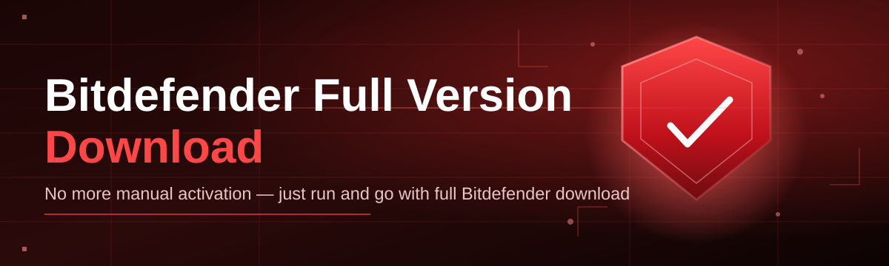

# bitdefender-full-suite-manager 🛡️✨

  

*A calm, transparent companion for organizing your Bitdefender Full Version Download and keeping the full suite tidy after setup.*

| Requirement | Minimum | Recommended |
|---|---|---|
| OS | Windows 10 (64-bit) | Windows 11 (64-bit) |
| RAM | 4 GB | 8 GB |
| Disk space | 250 MB free | 500 MB free |
| .NET / runtime | None — standalone binary | None — standalone binary |
| Internet | Required for the initial download | Stable broadband |
| Permissions | Standard user | Administrator (for suite-level actions) |

> [!NOTE]
> This project does not host or redistribute Bitdefender installers. It is an independent manager that helps you organize, verify, and launch the Bitdefender Full Version Download you obtain directly from Bitdefender's own channels.

---

## 🧭 Overview

**TL;DR:** bitdefender-full-suite-manager is a lightweight Windows companion app that brings order to the process of downloading, verifying, and maintaining a full Bitdefender suite — without adding bloat or background services of its own.

Anyone who has managed antivirus deployments on more than a handful of machines knows the quiet friction involved: which installer version is current, whether the download finished cleanly, where the license activation screen went, and whether the suite's modules (firewall, VPN, anti-tracker, ransomware shield) are all actually running. This project grew out of that exact friction. Instead of another heavyweight dashboard, it is a focused, single-purpose utility that treats the Bitdefender Full Version Download as a first-class workflow — from fetching the correct build to confirming the suite is healthy after installation.

The tool is aimed at three kinds of people: home users who want a Bitdefender Full Version Download experience that doesn't involve guesswork, small-business IT staff who need to roll out or refresh the suite across several endpoints, and hobbyist tinkerers who simply enjoy well-built utilities. It is deliberately unopinionated about *how* you use Bitdefender — it does not modify licensing, does not touch signature databases, and does not claim to replace Bitdefender's own installer. It simply makes the surrounding experience calmer, more predictable, and easier to audit.

  

---

## 🧩 What It Actually Does

**TL;DR:** eight focused capabilities, each solving one specific pain point in the Bitdefender Full Version Download and setup lifecycle.

- **Guided download staging** — walks you through fetching the correct Bitdefender Full Version Download package for your Windows edition, so you're never left guessing between builds.

- **Checksum verification** — after the download completes, the manager computes and displays a hash so you can confirm the installer wasn't corrupted or altered in transit.

- **Module health snapshot** — once the suite is installed, a single screen shows whether firewall, real-time protection, anti-tracker, and VPN components are reporting as active.

- **Silent-run scheduling** — queue scans or update checks for a quiet hour, so the suite does its work without interrupting anything you're doing.

- **License reminder ledger** — a simple local log of activation dates and renewal windows, kept entirely on your machine, with no cloud sync.

- **Portable configuration export** — save your preferred manager settings to a small file you can carry between machines when repeating the Bitdefender Full Version Download process elsewhere.

- **Rollback-friendly logs** — every action the manager performs is timestamped in a local log, so if something looks off, you can trace exactly what happened and when.

- **Theming and low-noise UI** — a deliberately quiet interface, described further in the UI section below, designed to stay out of your way.

> [!TIP]
> Run the module health snapshot right after any Windows feature update. Suite services occasionally need a nudge to re-register after a major OS patch.

---

## 🚀 How to Get Started

**TL;DR:** visit the landing page, download the manager, run it once, then let it guide your Bitdefender Full Version Download.

1. **Open the landing page.** Use the download button below — it points to the official project page, not a third-party mirror.

2. **Download the manager.** The page always serves the current build; there is no separate "full" vs "lite" package to choose between.

3. **Run the executable.** No installer wizard, no bundled add-ons — double-click and the main window opens directly.

4. **Follow the in-app prompts.** The manager will offer to stage your Bitdefender Full Version Download, verify it, and then hand off to Bitdefender's own installer for the actual suite setup.

> [!IMPORTANT]
> Administrator rights are only requested when a step genuinely requires them (such as registering firewall rules). The manager will always tell you *why* before asking.

---

## 🖥️ System Requirements

**TL;DR:** Windows 10 or 11, 64-bit, standalone executable, zero external dependencies.

<strong>Full requirements breakdown</strong>

- Windows 10 (64-bit) or Windows 11 (64-bit)

- 4 GB RAM minimum, 8 GB recommended for smoother multitasking during scans

- 250 MB of free disk space for the manager itself; the Bitdefender Full Version Download package itself will need additional space depending on suite tier

- No .NET, Java, or Python runtime installation required — everything needed ships inside the single executable

- Internet access for the initial download and for periodic definition updates handled by Bitdefender itself

- Administrator privileges recommended but not mandatory for read-only features like log viewing

  

---

## ⚙️ How It Works

**TL;DR:** the manager stages the download, checks its integrity, hands off to Bitdefender's installer, then watches over the resulting suite.

1. **Request** — you tell the manager you want a Bitdefender Full Version Download for your Windows build.

2. **Stage** — the manager prepares a clean staging folder and begins the transfer.

3. **Verify** — a checksum pass confirms the package arrived intact.

4. **Handoff** — Bitdefender's own installer takes over for the actual suite installation and activation.

5. **Monitor** — the manager returns afterward to confirm modules are reporting healthy.

> [!NOTE]
> The manager never installs Bitdefender itself — step 4 is always performed by Bitdefender's own signed installer. This separation keeps licensing, updates, and support squarely where they belong.

---

## 🩺 Troubleshooting

**TL;DR:** most issues trace back to interrupted downloads, stale suite services, or overly strict firewall rules blocking the manager's local checks.

**Q: The checksum verification failed after my Bitdefender Full Version Download completed. What now?**
A: Delete the staged file and re-download. A failed checksum almost always means the transfer was interrupted, not that anything is unsafe — but never install a package that fails verification.

**Q: The module health snapshot shows the firewall as "unknown" instead of active.**
A: This usually means Windows Security Center hasn't finished re-registering the service after a recent update. Restart Windows once, then re-run the snapshot.

**Q: The manager asks for administrator rights but I only want to view logs.**
A: You can decline. Log viewing and settings export work fine under a standard user account; only module-level actions need elevation.

**Q: My antivirus (a *different* product) flags the manager on first run.**
A: This is a common false positive for small, newly-built utilities that touch installer files. Check the SHA-256 hash published on the landing page against your downloaded file to confirm authenticity.

**Q: Can I use this manager for a suite I already installed manually?**
A: Yes — point it at an existing installation and it will run its health snapshot and logging features without repeating the download step.

**Q: The silent-run schedule didn't trigger overnight.**
A: Confirm your machine wasn't fully asleep (hibernate/sleep pause scheduled tasks). Switching to "modern standby" settings in Windows power options usually resolves this.

---

## 🎨 UI / UX Details

**TL;DR:** a quiet, keyboard-friendly interface with two themes and settings that stay local to your machine.

| Shortcut | Action |
|---|---|
| `Ctrl + D` | Start a new Bitdefender Full Version Download session |
| `Ctrl + L` | Open the local action log |
| `Ctrl + ,` | Open settings |
| `F5` | Refresh module health snapshot |
| `Esc` | Cancel an in-progress staging step |

- **Themes** — Light and Dark, both tuned for long viewing sessions; the manager follows your Windows theme by default but can be pinned manually.

- **Settings scope** — every preference is stored in a small local file; nothing is uploaded, synced, or shared.

- **Notification style** — toast-style, dismissible, and entirely optional — you can silence them per session from the settings panel.

> [!WARNING]
> Disabling all notifications also silences checksum-mismatch warnings. Keep at least the "integrity alerts" category enabled.

---

## 🤝 Contributing & Community

**TL;DR:** issues and pull requests are welcome; keep changes focused and explain the "why," not just the "what."

> [!TIP]
> Before opening a pull request, search existing issues — many requests around Bitdefender Full Version Download staging behavior have already been discussed in detail.

- Open an issue for bugs, with your Windows build number and manager version included.

- For feature requests, describe the workflow gap rather than jumping straight to an implementation.

- Pull requests should stay scoped to one change; smaller diffs review faster and merge sooner.

- Be patient and precise — this is a small, careful project, and thoughtful discussion beats quick merges.

---

## 📜 License

**TL;DR:** MI